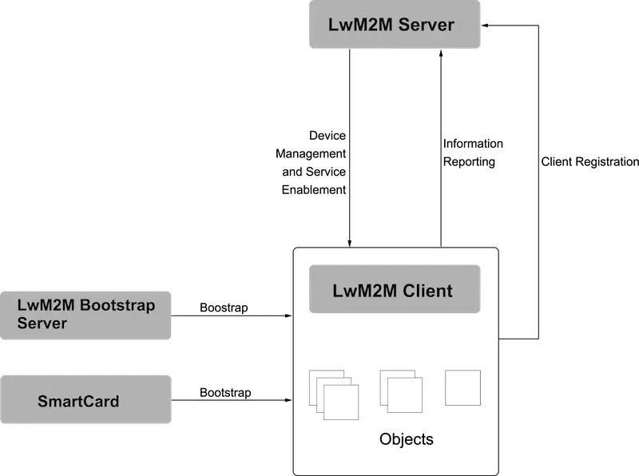
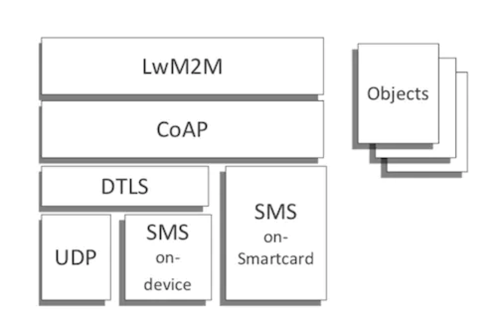

###LwM2M简介

LwM2M的全称是Lightweight Machine-To-Machine，它的名称里面包含了这么两个重要含义：
1. 这个协议是轻量级的
2. 这个协议适用于物联网设备。

LwM2M协议是由OMA（Open Mobile Alliance）提出并定义的。OMA这个组织专注于移动通讯以及物联网产业的标准开发，给自己的定位是“规范大工厂”。随着“万物皆可联”概念的兴起，物联网终端数目急剧膨胀，也不再局限于智能手机这样的强力大块头。有很多设备，要么电量有限，要么内存有限，要么可使用带宽有限，之前那些适于强劲终端设备管理的协议对它们来说有些太重了难以承受，因此，为了照顾到这些资源有限的小个子设备们，LwM2M协议在2013年底诞生了。目前的成熟版本号依然是1.0，OMA的专家们正在努力整1.1版。

概括地说：LwM2M是适用于资源有限的终端设备管理的轻量级物联网协议。

###LwM2M架构

协议最主要的实体包括LwM2M Server和LwM2M Client。

- LwM2M Server作为服务器，部署在M2M服务供应商处或网络服务供应商处。
- LwM2M Client作为客户端，部署在各个LwM2M设备上。

此外，根据需要还可以加入LwM2M引导服务器（Bootstrap Server）或智能卡（SmartCard），对客户端完成初始的引导。

###LwM2M接口

在这些实体之间，协议定义了4个接口，来实现预期的功能。

1. 引导接口（Bootstrap）
引导接口的目的是向LwM2M客户端提供注册到LwM2M服务器的必要信息，例如服务器访问信息、客户端支持的资源信息等。这些引导信息可以是由生产厂家预先存储在设备中，也可以通过上文提到的LwM2M引导服务器或者智能卡提前写入设备。

2. 客户端注册接口（Client Registration）
注册接口的目的是使LwM2M客户端与LwM2M服务器互联，将LwM2M客户端的相关信息存储在LwM2M服务器上。只有完成注册后，LwM2M客户端与服务器端之间的通信与管理才成为可能。

3. 设备管理与服务实现接口（Device Management and Service Enablement）
设备管理与服务实现接口的主控方为LwM2M服务器，服务器向客户端发送指令，客户端对指令做出回应并将回应消息发送给服务器。

4. 信息上报接口（Information Reporting）
信息上报接口允许LwM2M服务器端向客户端订阅资源信息，客户端接收订阅后按照约定的模式向服务器端报告自己的资源变化情况。

###LwM2M协议栈

考虑到与时俱进，实现简洁易懂的风格，LwM2M协议采用了REST。

但由于协议的服务对象是资源有限的终端设备，传统的HTTP数据传输方式显得过分笨重，难以支持受限资源，因此选择了具备REST风格的CoAP来完成消息和数据传递。一方面CoAP基于UDP，与TCP相比，在网络资源有限及无法确保设备始终在线的环境里更加游刃有余（出于安全性考虑，使用了基于UDP的DTLS安全传输协议）。另一方面CoAP本身的消息结构非常简单，报文压缩，主要部分可以做到特别小巧，无需占用过多资源。

出于类似的考虑，协议的数据结构必须足够简单。LwM2M协议定义了一个以资源（Resource）为基本单位的模型，每个资源可以携带数值，可以指向地址，以表示LwM2M客户端中每一项可用的信息。资源都存在于对象实例中（Object Instance），即对象（Object）的实例化。LwM2M协议预定义了8种对象（Object）来满足基本的需求，分别是：

考虑到扩展性，协议也允许根据实际需要自定义更多的对象。在这样的数据模型中，资源、对象实例以及对象都是用数字对应的ID来表示的，以实现最大程度的压缩，因此任何资源都可以用最多3级的简洁方式表示，例如/1/0/1表示服务器对象（Server Object）第1个实例中的服务器短ID资源。 在注册阶段，LwM2M客户端把携带了资源信息的对象实例传递给LwM2M服务器，以通知服务器自身设备所具备的能力。

###About LwM2M
https://zhuanlan.zhihu.com/p/104525994

###About OMA
https://github.com/OpenMobileAlliance/OMA_LwM2M_for_Developers/wiki/LwM2M-Open-Source-Code
https://github.com/OpenMobileAlliance/lwm2m-registry

###Eclipse Leshan
Eclipse Leshan是OMA LwM2M的客户端和服务端的轻量级实现，它不是独立的服务器和客户端，而是一套可以用来开发自己的Lightweight M2M的服务端和客户端的开源的Java库。

项目地址：https://github.com/eclipse/leshan

[Eclipse leshan证书格式](https://blog.csdn.net/xiaos76/article/details/102971948?utm_medium=distribute.pc_relevant.none-task-blog-BlogCommendFromMachineLearnPai2-6.channel_param&depth_1-utm_source=distribute.pc_relevant.none-task-blog-BlogCommendFromMachineLearnPai2-6.channel_param)

[Credential files format](https://github.com/eclipse/leshan/wiki/Credential-files-format)