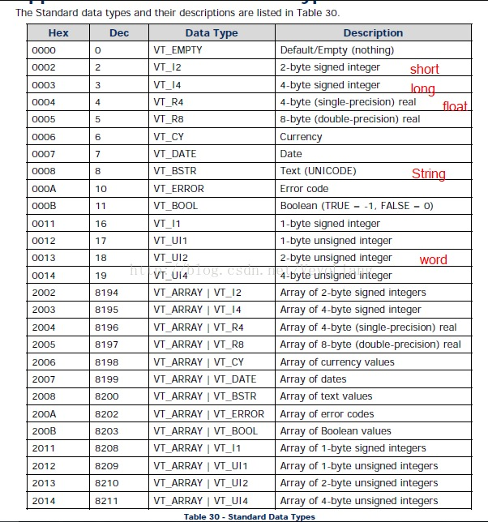

#OPC总结

##OPC Server协议

1. OPC DA: Data Access协议，是最基本的OPC协议。OPC DA服务器本身不存储数据，只负责显示数据收集点的当前值。客户端可以设置一个refresh interval，定期刷新这个值。目前常见的协议版本号为2.0和3.0，两个协议不完全兼容。也就是用OPC DA 2.0协议的客户端连不上OPC DA 3.0的Server
2. OPC HDA: Historical Data Access协议。前面说过DA只显示当前状态值，不存储数据。而HDA协议是由数据库提供，提供了历史数据访问的能力。比如价格昂贵的Historian数据库，就是提供HDA协议接口访问OPC的历史数据。HDA的Java客户端目前我没找到免费的。
3. OPC UA: Unified Architecture统一架构协议。诞生于2008年，摒弃了前面老的OPC协议繁杂，互不兼容等劣势，并且不再需要COM口访问，大大简化了编程的难度。基于OPC UA的开源客户端非常多。不过由于诞生时间较晚，目前在国内工业上未大规模应用，并且这个协议本身就跟旧的DA协议不兼容，客户端没法通用。
---
我们的目标环境绝大多数是OPC DA 2.0的Server，极个别可能有OPC DA 3.0。当时找到的很多类库实现的都是OPC UA的。

##OPC存储格式
OPC存储和传统的关系型数据库存储格式有很大的不同，不同于关系型数据库的表存储，OPC存储格式是树形结构，Server端的存储格式如下:
```
host
`-- OPC Server Name
    `-- tag1: value, type, timestamp, ...,
    `-- tag2: value, type, timestamp, ...,
    `-- tag3: ...
    ...
```

每个主机上可能存在多个OPC Server，每个Server下面有若干个tag，就是各个数据收集点当前的值，会定期更新。每个tag包含的内容大致有当前值，值类型，时间戳等等数据。是一种树形结构。所以客户端连接的时候需要指明服务器的ip或主机名，需要连接的OPC服务名，以及监听哪些tag的数据。

Client端存储的格式如下:
```
Group1
`-- tag1
`-- tag2
`-- tag3
Group2
`-- tag4
`-- tag5
...
```

##COM
Component Object Model对象组件模型，是微软定义的一套软件的二进制接口，可以实现跨编程语言的进程间通信，进而实现复用。

##DCOM
Microsoft Distributed Component Object Model，坑最多的一个玩意。字面意思看起来是分布式的COM，简单理解就是可以利用网

##OPC data type



##相关在线文档
[Java实现OPC通信](https://www.cnblogs.com/Frankie1980/p/10830119.html)

[OPC主要功能](https://www.hifreud.com/2014/12/27/opc-3-main-feature-in-opc/)

[OPC Client Java调用之Utgard](https://www.hifreud.com/2014/12/27/opc-4-client-invoke-use-utgard)

[OPC Utgard的数据访问方式](https://www.cnblogs.com/myboat/p/11739329.html)


